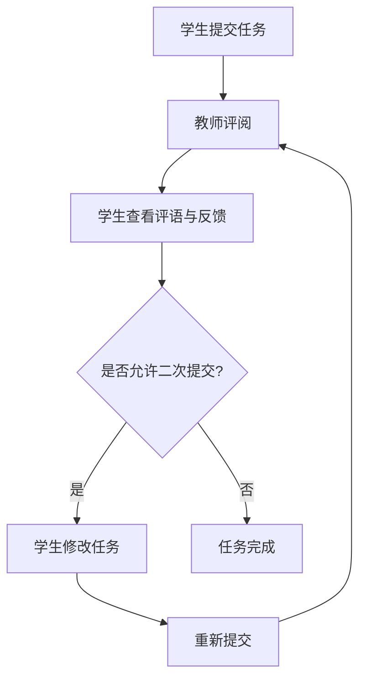

# 工程实践1 第1章：成绩与反馈模块

## 功能概述

成绩与反馈模块是工程实践课程中的重要组成部分，为学生提供教师评阅结果的查看入口，帮助学生了解自己的学习表现并获取改进方向。该模块涵盖以下核心功能：

1. **评语展示**：学生可查看教师对其提交任务的详细评语，包括整体评价和具体反馈。
2. **扣分项说明**：逐项展示扣分原因，让学生清楚了解评分依据。
3. **改进建议**：以条目形式列出具体的改进方向和建议，帮助学生有针对性地提升。
4. **二次提交支持**：对允许二次提交的任务，学生可基于教师反馈重新提交作业。

## 详细功能说明

### 1. 教师评语展示

学生在提交任务并获得教师评阅后，可在该模块中查看教师的完整评语。评语内容包括：

- **整体评价**：教师对学生任务的整体完成情况的总结性评价。
- **亮点指出**：教师对学生任务中表现突出的部分给予肯定。
- **问题反馈**：教师针对任务中存在的问题进行具体说明。

### 2. 扣分项说明

扣分项以列表形式逐条展示，每项包含：

| 项目 | 说明 |
|------|------|
| 扣分项名称 | 具体的扣分条目名称 |
| 扣分分值 | 该项扣除的分数 |
| 扣分原因 | 扣分的具体原因描述 |

这种透明化的展示方式让学生清楚了解每一项扣分的依据，避免产生争议。

### 3. 改进建议展示

改进建议以条目形式展示，每条建议包含：

- **问题描述**：当前存在的不足之处
- **改进方向**：具体可操作的改进建议
- **参考资源**：相关的学习资料或参考资料链接（如有）

### 4. 二次提交功能

对于教师允许二次提交的任务，系统提供重新提交入口。具体流程如下：

1. 学生查看评阅结果和改进建议
2. 根据反馈修改完善任务内容
3. 点击「重新提交」按钮上传新的任务文件
4. 教师重新评阅并更新评阅结果

## 验收标准

- [x] 每次评阅结果展示教师评语和扣分项
- [x] 改进建议以条目形式展示
- [x] 允许二次提交的任务展示重新提交入口

## 相关模块

- **工程实践2**：任务提交与评阅管理
- **工程实践3**：自动化评分与统计分析
- **教师后台**：评阅与反馈发布功能
