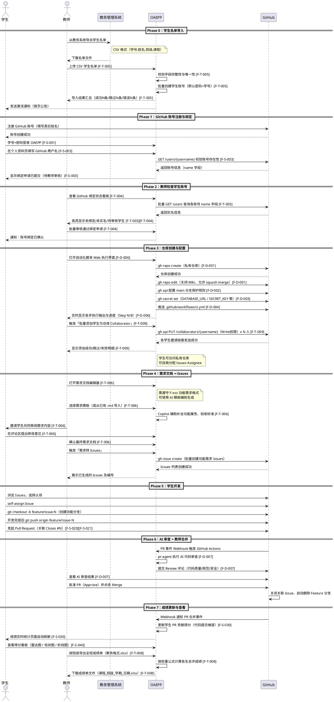

# 工程实践4-管理平台软件需求

## 1. 文档目标

本文档定义《工程实践》课程管理平台的需求范围与实现约束。

- 实现框架：Reflex（https://reflex.dev）
- 开发语言：Python（前后端统一）
- 当前范围：优先定义“学生功能”

> 说明：教师端、助教端、管理员端将在后续章节补充，本章先完成学生端需求冻结。

## 2. 产品定位

《工程实践》课程管理平台用于支撑工程实践1-4全过程教学，围绕“任务发布—学习过程—提交反馈—成绩追踪”形成闭环。

平台第一阶段聚焦学生侧核心体验：

1. 看得到：课程信息、章节任务、通知日历清晰可查。
2. 做得完：作业/实验提交流程顺畅，支持多次迭代。
3. 跟得上：成绩、评语、进度可追踪。
4. 不掉线：支持移动端访问，基础网络波动可恢复。

## 3. 技术约束（Reflex）

### 3.1 架构约束

- 使用 Reflex 的全栈模式（UI + 状态 + 事件处理 + 数据访问统一 Python）。
- 前端页面通过 Reflex 组件构建，交互通过事件（event handlers）驱动。
- 页面状态必须通过 State 管理，禁止将敏感数据硬编码到静态前端内容。

### 3.2 认证与安全约束

- 学生身份认证可采用本地账号体系或第三方认证集成（如 Google/OAuth 类方案）。
- 涉及私有信息（成绩、评语、个人资料）的读取与写入必须在后端事件中进行权限校验。
- 敏感 token / 会话信息仅存储于后端可控变量或安全会话机制中。

### 3.3 数据层约束

- 数据模型基于 Reflex `rx.Model` / SQLModel 体系。
- 数据库迁移遵循 Alembic 流程（初始化、迁移生成、迁移执行）。
- 生产环境必须使用可持久化数据库（非仅本地临时文件）。

## 4. 角色与边界

### 4.1 角色

- 学生（本文档重点）
- 教师（同时承担系统管理员职能）
- 助教（通过 GitHub 特殊账号授权，Triage 权限，不单独作为平台角色）

### 4.2 学生端边界

- 学生仅可访问本人课程数据、本人提交记录、本人成绩与反馈。
- 学生不可查看其他学生的成绩、私有提交内容和教师后台配置。

## 5. 功能需求

## 5.1 学生账户与身份

### F-S-001 登录/退出

- 学生可通过学号/邮箱 + 密码登录。
- 登录后可主动退出并清除会话。
- 连续登录失败达到阈值后触发临时限制与提示。

### F-S-002 个人资料

- 学生可查看并编辑个人基础信息（姓名、班级、联系方式）。
- 学生可修改密码。

### F-S-003 GitHub 账号绑定

- 学生登录后可在个人资料页填写自己的 GitHub 用户名，系统将自动通过 GitHub API 校验账号是否存在。
- 校验通过后呈现绑定状态（已绑定 / 未绑定 / 账号不存在）；每个学生只允许绑定一个账号。
- 绑定申请提交后需教师审核确认（防止冒用他人账号）。
- 已绑定帐号希望修改时需向教师申请解除旧绑定。

## 5.2 课程与章节学习

### F-S-010 课程主页

- 展示学生已选课程（工程实践1-4）与当前学习进度。
- 每门课程展示：章节数、已完成任务数、截止提醒。

### F-S-011 章节内容浏览

- 学生可按章节查看学习资料、任务说明、评分标准。
- 支持章节内附件下载（文档、模板、参考代码包）。

### F-S-012 公告与通知

- 展示课程公告、作业截止提醒、成绩发布通知。
- 未读通知需有明显标识。

## 5.3 作业/实验提交

### F-S-020 作业提交

- 学生可在截止前提交作业（文本、附件或两者结合）。
- 支持常见格式：`pdf`、`docx`、`zip`、`py`、`c`、`cpp`（最终以后端配置为准）。
- 展示提交时间、文件大小、版本号。

### F-S-021 多次提交与版本记录

- 在教师允许的前提下，学生可重复提交，系统保留历史版本。
- 最新版本默认为评阅版本，历史版本可回溯查看。

### F-S-022 截止规则

- 截止前可正常提交。
- 截止后按课程策略处理：禁止提交或标记迟交。
- 迟交状态需在学生端明确显示。

## 5.4 成绩与反馈

### F-S-030 成绩实时统计

- 学生登录后可实时查看本人当前综合得分，得分来源包括：考勤、在线考试、代码提交、PR 审查。
- 各维度得分实时更新（将相关事件嵌入 Reflex 状态更新链），无需手动刷新。
- 展示各维度得分晠细：
  - 出勤得分：课堂点名縯计，自动按到课率计算
  - 考试得分：各次在线考试各题得分列表
  - 代码提交：各任务代码评阅得分
  - PR 贡献：参与代码审查次数与质量
- 展示评分时间、评分人（教师/助教）；待评分项标注状态提示。

### F-S-031 评语与改进建议

- 学生可查看教师评语、扣分项说明、改进建议。
- 对允许二次提交的任务，学生可基于反馈再次提交。

### F-S-032 成绩单 Excel 导出

- 学生可一键下载本人全期成绩单，格式符合课程要求的标准 Excel 模板（`.xlsx`）。
- 导出内容包含：学号、姓名、各任务得分、总评成绩、提交时间、批改时间。
- 导出文件中禁止包含其他同学数据（个人成绩单只包含本人信息）。
- 文件名默认格式：`学号_姓名_成绩单_课程名称.xlsx`。
- 教师端将在教师功能中支持按班级批量导出全班成绩单。

## 5.5 学习进度与统计

### F-S-040 得分看板与可视化

- 登录后首屏展示总得分以及各维度分项得分的图形列表：
  - **雷达图**：出勤 / 考试 / 代码 / PR 四维度得分比较
  - **柱状图**：各次考试得分历史趋势
  - **线形图**：全期总得分随时间变化曲线
- 所有图表基于 Reflex 内置图表组件（或集成 `recharts`）渲染，无需外部工具。
- 展示任务完成率、已提交/未提交数量、即将到期任务；提供按课程（工程实践1-4）筛选。

### F-S-041 时间线

- 按时间展示“任务发布—提交—批改—反馈”关键节点。

## 5.6 交互与可用性

### F-S-050 响应式界面

- 学生端需适配桌面与移动端常见分辨率。

### F-S-051 异常提示

- 上传失败、网络中断、权限不足等场景提供可理解错误提示。
- 支持失败后重试。

## 5.7 课堂互动

### F-S-052 课堂点名

- 教师发起点名后，学生在限定时间窗口（默认 60 秒）内通过 App 或浏览器确认到场。
- 支持地理围栏辅助验证（可选配置，防止代签）。
- 点名记录自动写入出勤表，学生可查看本人历史出勤状态。
- 迟到（超时签到）与缺勤分级记录。

### F-S-053 课堂在线考试

- 支持教师发布限时考试题目（单选、多选、填空、简答）。
- 学生可在手机浏览器答题，无需安装额外 App（Reflex 响应式界面自适应）。
- 作答过程实时保存草稿，防止意外断线丢失进度。
- 提交后显示成绩（客观题立即出分，主观题标记待批）。
- 考试期间禁止查看他人答案；截止时间到自动提交。

## 5.8 开发运维与项目配置

### F-D-001 仓库初始化

- 平台源码托管于 GitHub 私有仓库。
- 仓库初始化时配置 `.gitignore`（Python 模板）与开源协议。

### F-D-002 分支保护

- `main` 分支启用保护规则：PR 审查必须通过后方可合并。
- 禁止直接 Force Push 至主分支。
- 至少需要 1 名成员 Approve。

### F-D-003 Secrets 管理

- 生产环境敏感配置（数据库连接串、部署令牌、会话密钥）一律存入 GitHub Secrets。
- 禁止将 Secrets 硬编码或提交至代码仓库。

### F-D-004 CI 自动化

- 每次 PR 自动触发 GitHub Actions：代码 lint（Ruff）+ 单元测试（pytest）。
- CI 通过为合并前置条件，CI 失败时不可合并。

### F-D-005 协作者权限管理

- 仓库成员按角色分配权限：Admin / Write / Triage / Read。
- 使用 GitHub Team 统一管理课程组成员权限，禁止个人直接授权。

### F-D-006 自动化脚本 Web 执行界面

- 平台提供 Web 配置向导页面，支持一键调用服务器端脚本（如 `gh` CLI 初始化仓库、设置分支保护、注入 Secrets 等）。
- 执行过程实时推送脚本输出到页面（基于 Reflex 事件流 `yield`），每行输出逐步追加显示。
- 捕获脚本非零退出码与 stderr，在页面以红色标记错误行，提供可复制的完整错误日志。
- 以进度条或步骤列表展示当前执行进度（如《Step 3/8》已完成）。
- 执行完成后显示汇总状态（成功 / 失败），并提示可重试的失败步骤。

### F-D-007 代码审查与 PR 提示词模版管理

- 平台支持配置自动代码审查：通过 GitHub Actions 集成 pr-agent（或等效工具），每次 PR 自动触发 AI 审查。
- 系统内置三套提示词模版：通用代码审查、工程实践规范检查、安全全面审查。
- 用户可在高级设置页面编辑任意模版内容，并保存为自定义模版（带名称 + 描述）。
- 自定义模版可设为默认，下次 PR 自动审查时使用该模版。
- 支持对模版进行复制、重命名、删除操作；提供模版忽略规则（如忽略特定路径或文件类型）。
- 模版配置存储在仓库的 `.github/review-prompts/` 目录下，纳入 Git 版本控制。

**修改代码审核 AI 提示词**

- 教师可在提示词编辑器中独立维护「代码审核提示词」（Code Review Prompt），用于评估代码质量、注释规范、命名风格、潜在 Bug 等。
- 编辑器提供语法高亮和占位符提示（`{diff}`、`{pr_title}`、`{pr_description}` 等 pr-agent 内置变量）。
- 修改后可点击「保存并应用」，平台自动将新提示词写入 `.github/review-prompts/code-review.prompt.md` 并提交到仓库。

**修改 PR 的 AI 提示词**

- 教师可在提示词编辑器中独立维护「PR 描述/总结提示词」（PR Summary Prompt），用于自动生成 PR 摘要、变更说明和影响范围分析。
- 修改后平台自动写入 `.github/review-prompts/pr-summary.prompt.md`。

**配置完成后验证**

- 平台提供「验证配置」按钮：发起一次针对目标仓库中最近一条 PR（或测试 PR）的 Dry-Run AI 审查，将审查结果输出到平台内置预览区（不提交到 GitHub）。
- 验证结果中展示：AI 调用状态（成功/超时/错误）、实际使用的提示词版本、返回审查评论片段预览。
- 若验证失败（如 API Key 无效、仓库权限不足），平台高亮显示具体错误原因，并提供修复建议链接。

**验证结束后删除验证痕迹**

- 验证过程产生的临时数据（Dry-Run 输出、临时测试 PR、Draft 评论草稿）在确认后一键清除。
- 「清除验证痕迹」操作包含：删除 Dry-Run 生成的临时 GitHub Draft Comments（若有）、清空平台预览区缓存、清除本轮验证日志。
- 操作日志保留「验证时间、操作人、清除时间」三条审计记录，但审查内容本身不持久化。

### F-D-008 GitHub 快捷链接面板

- 平台在开发运维页面提供一组 GitHub 关键快捷链接，支持一键跳转到常用页：
  - 仓库主页
  - Pull Requests 列表
  - Issues 列表
  - Actions / CI 运行记录
  - 分支管理
  - Settings → Secrets
  - Settings → Branches（分支保护）
- 链接基于已配置的仓库 URL 自动生成，无需手动填写。
- 支持自定义标签名称和显示顺序；可隐藏不需要的链接。
- 页面布局中常驻显示（侧边栏或卡片区），无需切换页面即可快速跳转。

## 5.9 教师基础功能

### F-T-001 学生—GitHub 账号对应表

> 此表是整个系统的核心基础数据。所有基于 GitHub 活动（提交、PR、审查）的得分和统计均依赖此表将真实身份与 GitHub 账号映射。

- 教师可在后台查看全班学生与对应 GitHub 账号的完整对应表。
- 支持批量导入（CSV 格式：学号，姓名，GitHub 用户名），自动校验 GitHub 用户名的合法性。
- 支持单条手动新增、编辑、删除对应关系。
- 对应关系变更后，相关学生的历史成绩数据自动重算并更新。
- 表格支持按班级、课程筛选，支持导出当前表格为 CSV。
- 一个学生只允许绑定一个 GitHub 账号；远程账号共用时系统提示冲突。

### F-T-002 VS Code 扩展配置与 Copilot 提示词管理

- 教师可在管理页面配置课程必装/推荐 VS Code 扩展列表，系统自动生成 `.vscode/extensions.json`。
- 支持按扩展类型分组：必装（`recommendations`）/ 建议（备注）/ 禁止（`unwantedRecommendations`）。
- 每条扩展可输入扩展 ID、显示名称、安装理由；系统提供常用扩展预置模版（Python开发、Copilot、Reflex 开发等）。
- 教师可配置课程全局 Copilot 指令文件（`.github/copilot-instructions.md`），系统提供基础模版，支持在线编辑保存。
- 按不同课程模块配置对应的 `.github/instructions/*.instructions.md` 文件；模版内容可在页面直接编辑。
- 配置完成后可一键提交到仓库，自动触发 CI 检查扩展配置格式合法性。

### F-T-003 GitHub 账号实名核查

- 系统通过 GitHub API（`GET /users/{username}`）自动获取每个学生绑定账号的 `name` 字段。
- 在学生-GitHub 账号对应表中展示核查状态列：已登记姓名 / 未登记姓名 / 姓名不符。
- 教师可一键触发全班批量核查，也可对单个学生手动重新核查。
- 对于未登记真实姓名的账号，系统显示警告并可一键发送提醒通知，附上学生 GitHub 账号登记姓名的操作说明链接。
- 核查结果在对应表中标注，记录最近核查时间。

### F-T-004 GitHub 账号绑定状态看板

- 教师端展示全班学生绑定状态汇总：已绑定人数 / 未绑定人数 / 待审核人数。
- 未绑定学生以显著颜色（红色）高亮显示，列表可按未绑定先排序。
- 待审核请求支持一键批量通过（批量确认学生自行绑定的账号）。
- 提供“向未绑定学生发送提醒”按鈕，直接发送首页公告或短信通知。

### F-T-005 学生名单导入

- 教师从教务管理系统导出学生名单（CSV 格式：学号，姓名，班级，课程），导入到 OAEPP。
- 导入时自动校验字段完整性、学号唯一性、班级与课程合法性；错误行高亮显示，支持修正后重新导入。
- 导入成功后自动创建学生账号（默认密码为学号），并发送激活邀请频道（邮件或首页公告）。
- 支持增量导入（重复学号跳过，新增学生追加）和全量覆盖两种模式。
- 导入日志可查，记录每次导入时间、批次、导入人、记录数。

### F-T-006 需求文档编辑器

- OAEPP 提供内置 Markdown 编辑器，预置功能需求模版（`## 模块名
### F-xxx 功能名
- 功能描述`）。
- 集成 GitHub Copilot ，支持基于简说自动补全功能属性、验收标准、安全属性；提示词遵守 `.github/copilot-instructions.md` 模板。
- 支持从外部导入已有 `.md` 文件，自动解析并效验功能需求格式合规性。
- 文档渲染预览实时更新，完成后可一键提交到 GitHub 仓库。
- 审阅模式：学生可查阅需求内容，在评论区提出清晰化意见；教师确认后封存文档。

### F-T-007 Issue 关闭必填 PR 编号

> **重要**：Issue 是需求的最小可追踪单元。关闭 Issue 时不关联 PR 则无法验证需求已实现，因此平台将其作为**强制工作流规则**执行。

> **最佳实践**：学生在 PR 描述中写 `Closes #Issue-ID`，GitHub 在 PR 合并时自动关闭对应 Issue，完全匹配
> **"提交 PR → 评审 → 合并 → 关闭 Issue → 任务完成"** 的教学闭环，可追溯、易管理、合规。

- 教师在「开发运维」页面可开启「关闭 Issue 必须关联 PR」规则开关（默认开启）。
- 规则生效后，任何角色（学生、教师、助教）在 OAEPP 内操作关闭 Issue 时，系统强制弹出对话框，要求填写关联的 **PR 编号**（仅接受同仓库内已存在的 PR 编号，实时调用 GitHub API 校验）。
- **推荐方式**：学生提交 PR 时在描述中加入 `Closes #N`，合并后 GitHub 自动关闭 Issue，平台识别此自动关闭事件并标记为「PR 自动关联关闭」，无需额外填写，满足规则要求。
- 若关联 PR 尚未合并（Merged），平台显示警告：「该 PR 尚未合并，确认仍要关闭 Issue？」，并要求教师二次确认。
- 已关闭 Issue 的详情页展示关联 PR 编号及其合并状态，方便复查。
- 若通过 GitHub Web 直接关闭 Issue（绕过 OAEPP），平台 Webhook 监听到 `issues.closed` 事件后，检查该 Issue 是否有关联 PR；若缺失则在 OAEPP 后台生成「未填 PR 警告」记录，并在教师端 Issues 管理页高亮提示。
- 规则配置（开启/关闭、是否允许跨仓库 PR、警告策略）保存到平台数据库，支持按课程独立设置。

### F-T-008 教师成绩单导出

- 教师可在成绩管理页面按班级批量导出全班学生成绩单，格式符合教务系统要求（`.xlsx`，包含固定列顺序与表头）。
- 导出模板包含必填列：**学号、姓名、班级、课程名称、出勤得分、考试得分、代码提交得分、PR 贡献得分、总评成绩、等级（A/B/C/D/F）、备注**。
- 总评成绩按课程配置的权重公式自动计算（各维度权重可由教师在系统设置中调整）。
- 支持按班级、课程、学期筛选导出范围；导出前可预览表格数据并手动修正个别单元格。
- 导出文件名格式：`课程名称_班级_学期_成绩单_导出日期.xlsx`。
- 导出操作记录审计日志（导出人、时间、筛选条件、记录数）。
- 导出时允许追加教师自定义备注列（如「附加说明」），该列内容不参与计算，仅供教务阅读。

### F-T-009 学生仓库访问权限配置

> 依赖前提：F-T-001（学生-GitHub 账号映射表）已完整录入且账号绑定已审核通过（F-T-004）。

- 教师可一键将全班已绑定 GitHub 账号的学生批量添加为课程仓库的 Collaborator（权限级别：**Write**），支持选择仓库列表。
- 平台通过 `gh api --method PUT /repos/{owner}/{repo}/collaborators/{username} -f permission=write` 批量执行，执行进度在页面实时显示。
- 添加成功后学生可访问私有仓库、创建功能分支、提交 PR，并可将自己设置为 Issues 的承担人（Assignee）。
- 支持查看当前 Collaborator 列表及其权限级别；可单独移除某位学生的仓库访问权限。
- 若部分学生 GitHub 账号未绑定或未审核，平台高亮显示跳过列表，需教师手动处理后再次补充执行。
- 操作日志记录每次批量添加的执行时间、操作人、添加成功数、失败数及失败原因。

## 6. 非功能需求（学生端）

### 6.1 性能

- 常规页面（课程主页、章节页）在校园网环境下首屏响应目标 ≤ 3 秒。
- 单文件上传进度可见，上传中断后允许重新发起。

### 6.2 安全

- 全站 HTTPS。
- 关键操作（登录、提交、成绩查询）必须有身份校验与权限控制。
- 学生仅访问本人私有数据。

### 6.3 可维护性

- 功能按模块拆分：账户、课程、提交、成绩、通知。
- 关键业务事件（提交、评分发布）记录审计日志。

## 7. 学生功能验收标准（第一阶段）

满足以下条件可视为学生端一期通过验收：

1. 学生可完成登录、浏览章节、提交任务、查看成绩与评语全流程。
2. 支持至少一种可扩展认证方案与一种持久化数据库方案。
3. 作业多次提交与版本记录可用。
4. 截止规则可配置并在界面正确反馈。
5. 学生不可越权访问他人数据。

## 8. 后续章节占位

后续将补充：

- 教师功能需求完整规格（任务发布 F-T-008、评分与评语 F-T-009、班级统计分析 F-T-010、系统配置 F-T-011 等）

## 9. 全功能UML组件图

```plantuml
@startuml
left to right direction
skinparam componentStyle rectangle
skinparam packageStyle rectangle
skinparam shadowing false

package "《工程实践》管理平台" {

	package "学生功能" {
		package "账户与身份" {
			component "登录退出" as student_login
			component "个人资料维护" as student_profile
			component "GitHub 账号绑定" as student_github_bind
		}

		package "课程与章节学习" {
			component "课程主页" as student_course_home
			component "章节内容浏览" as student_chapter
			component "公告与通知" as student_notice
		}

		package "作业与实验提交" {
			component "作业提交" as student_submit
			component "多次提交与版本记录" as student_version
			component "截止规则" as student_deadline
		}

		package "成绩与反馈" {
			component "成绩实时统计" as student_score
			component "评语与改进建议" as student_feedback
			component "成绩单 Excel 导出" as student_grade_export
		}

		package "学习进度与统计" {
			component "得分看板与可视化" as student_dashboard
			component "学习时间线" as student_timeline
		}

		package "交互与可用性" {
			component "响应式界面" as student_responsive
			component "异常提示与重试" as student_retry
		}

		package "课堂互动" {
			component "课堂点名" as student_attendance
			component "在线考试（手机端）" as student_exam
		}
	}

	package "教师功能（含管理员）" {
		component "学生-GitHub账号映射表" as teacher_map
		component "任务发布" as teacher_task
		component "评分与评语" as teacher_review
		component "统计分析" as teacher_stats
		component "用户与课程管理" as teacher_admin
		component "系统配置" as teacher_config
		component "VS Code扩展/Copilot指令配置" as teacher_vscode
		component "GitHub账号实名核查" as teacher_verify
		component "GitHub绑定状态看板" as teacher_bind_status
		component "学生名单导入" as teacher_roster
		component "需求文档编辑器" as teacher_req_editor
		component "Issue关闭必填PR编号" as teacher_issue_close
		component "成绩单批量导出（教务格式）" as teacher_grade_export_all
		component "学生仓库访问权限配置" as teacher_collab
	}

	package "开发运维与项目配置" {
		component "仓库初始化" as dev_repo
		component "分支保护" as dev_branch
		component "Secrets管理" as dev_secrets
		component "CI自动化" as dev_ci
		component "协作者权限管理" as dev_perm
		component "自动化脚本 Web 执行界面" as dev_wizard
		component "PR 审查与提示词模板" as dev_review
		component "GitHub 快捷链接面板" as dev_links
	}

	package "平台支撑能力" {
		package "技术与架构" {
			component "Reflex全栈Python" as support_reflex
			component "State状态管理" as support_state
			component "事件驱动交互" as support_event
		}

		package "安全与权限" {
			component "身份认证" as support_auth
			component "权限校验" as support_acl
			component "私有数据保护" as support_privacy
		}

		package "数据能力" {
			component "rx.Model与ORM" as support_orm
			component "Alembic迁移" as support_migration
			component "持久化数据库" as support_db
		}

		package "运维与质量" {
			component "响应性能目标" as support_perf
			component "审计日志" as support_audit
			component "HTTPS" as support_https
		}
	}
}

student_login --> support_auth
student_profile --> support_acl
student_github_bind --> support_acl
student_course_home --> support_state
student_chapter --> support_reflex
student_notice --> support_event
student_submit --> support_db
student_version --> support_orm
student_deadline --> support_event
student_score --> support_acl
student_feedback --> support_privacy
student_grade_export --> support_db
student_dashboard --> support_state
student_timeline --> support_db
student_responsive --> support_reflex
student_retry --> support_perf
student_attendance --> support_event
student_exam --> support_state

teacher_map --> support_db
teacher_task --> support_event
teacher_review --> support_acl
teacher_stats --> support_db
teacher_admin --> support_auth
teacher_config --> support_https
teacher_vscode --> support_event
teacher_verify --> support_acl
teacher_bind_status --> support_db
teacher_roster --> support_db
teacher_req_editor --> support_state
teacher_issue_close --> support_event
teacher_issue_close --> support_acl
teacher_grade_export_all --> support_db
teacher_collab --> support_auth
teacher_collab --> support_acl

dev_repo --> support_reflex
dev_secrets --> support_privacy
dev_ci --> support_event
dev_branch --> support_acl
dev_perm --> support_auth
dev_wizard --> support_event
dev_wizard --> support_state
dev_review --> support_event
dev_review --> support_acl
dev_links --> support_state

@enduml
```



## 10. 配套 GitHub 仓库配置指南

本节给出从零开始配置管理平台项目 GitHub 仓库的完整步骤，每个 Step 同时提供**浏览器操作**和 **`gh` CLI 命令行操作**两种方式，按需选择。

---

### 前置：安装并登录 gh CLI

```bash
# macOS
brew install gh

# Ubuntu / Debian
sudo apt install gh

# 登录（浏览器授权）
gh auth login
```

登录后验证身份：

```bash
gh auth status
```

---

### Step 1：创建仓库

**浏览器**：登录 GitHub → 右上角 **+** → **New repository** → 填写信息后点 Create。

**gh CLI**：

```bash
gh repo create oa-epp-platform \
  --private \
  --description "基于 Reflex 的《工程实践》课程管理平台" \
  --gitignore Python \
  --clone
```

| 字段 | 推荐值 |
|------|--------|
| Repository name | `oa-epp-platform` |
| Visibility | `--private` |
| .gitignore | `Python` |

---

### Step 2：基础仓库设置

**浏览器**：进入 **Settings → General** 调整 Features 和 Pull Requests 选项。

**gh CLI**：

```bash
# 关闭 Wiki，开启 Issues，允许 squash merge，合并后自动删除分支
gh repo edit oa-epp-platform \
  --enable-issues \
  --disable-wiki \
  --enable-squash-merge \
  --disable-merge-commit \
  --delete-branch-on-merge
```

---

### Step 3：分支保护规则

**浏览器**：进入 **Settings → Branches → Add branch protection rule**，对 `main` 配置保护项。

**gh CLI**（通过 GitHub API）：

```bash
gh api \
  --method PUT \
  -H "Accept: application/vnd.github+json" \
  /repos/{owner}/oa-epp-platform/branches/main/protection \
  --input - <<'EOF'
{
  "required_status_checks": {
    "strict": true,
    "contexts": ["lint-and-test"]
  },
  "enforce_admins": true,
  "required_pull_request_reviews": {
    "required_approving_review_count": 1,
    "dismiss_stale_reviews": true
  },
  "restrictions": null,
  "allow_force_pushes": false,
  "allow_deletions": false
}
EOF
```

> 将 `{owner}` 替换为你的 GitHub 用户名或组织名。

---

### Step 4：配置 Secrets

**浏览器**：进入 **Settings → Secrets and variables → Actions → New repository secret**。

**gh CLI**：

```bash
# 交互式输入（不会在 shell 历史中留下明文）
gh secret set DATABASE_URL
gh secret set SECRET_KEY
gh secret set REFLEX_DEPLOY_TOKEN
gh secret set REFLEX_API_URL

# 验证 Secrets 已创建（只显示名称，不显示值）
gh secret list
```

| Secret 名称 | 用途 |
|------------|------|
| `REFLEX_API_URL` | 部署后的 Reflex 服务地址 |
| `DATABASE_URL` | 生产数据库连接串 |
| `REFLEX_DEPLOY_TOKEN` | Reflex Cloud 部署令牌 |
| `SECRET_KEY` | 会话签名密钥 |

> **安全提示**：`gh secret set` 使用交互模式，Secret 值不会出现在 shell 历史中。

---

### Step 5：配置 GitHub Actions

在仓库根目录创建 `.github/workflows/ci.yml`：

```yaml
name: CI

on:
  push:
    branches: [main]
  pull_request:
    branches: [main]

jobs:
  lint-and-test:
    runs-on: ubuntu-latest
    steps:
      - uses: actions/checkout@v4

      - name: Set up Python
        uses: actions/setup-python@v5
        with:
          python-version: "3.12"

      - name: Install dependencies
        run: pip install -r requirements.txt

      - name: Lint
        run: |
          pip install ruff
          ruff check .

      - name: Run tests
        run: pytest tests/ -v
        env:
          DATABASE_URL: sqlite:///./test.db
```

**gh CLI** - 查看 workflow 状态：

```bash
# 查看最新运行结果
gh run list --limit 5

# 查看某次运行详情
gh run view <run-id>

# 手动触发 workflow
gh workflow run ci.yml
```

---

### Step 6：配置协作者与权限

**浏览器**：进入 **Settings → Collaborators and teams**。

**gh CLI**：

```bash
# 添加协作者（按用户名）
gh api --method PUT /repos/{owner}/oa-epp-platform/collaborators/{username} \
  -f permission=write

# 查看当前协作者列表
gh api /repos/{owner}/oa-epp-platform/collaborators
```

| 角色 | permission 值 |
|------|--------------|
| 项目负责人 | `admin` |
| 开发成员 | `write` |
| 助教/测试 | `triage` |
| 课程观察者 | `read` |

---

### Step 7：配置 Issue 与 PR 模板

本项目已内置 `.github/PULL_REQUEST_TEMPLATE.md`。添加 Issue 模板：

```bash
# 创建模板目录
mkdir -p .github/ISSUE_TEMPLATE
```

然后在 `.github/ISSUE_TEMPLATE/` 下创建 `bug_report.md` 和 `feature_request.md`，提交推送后 GitHub 自动识别。

---

### Step 8：配置 Topics 与描述

**浏览器**：仓库主页右上角齿轮图标（About）修改。

**gh CLI**：

```bash
gh repo edit oa-epp-platform \
  --description "基于 Reflex 的《工程实践》课程管理平台" \
  --homepage "https://oaepp.uwis.cn" \
  --add-topic reflex \
  --add-topic python \
  --add-topic education \
  --add-topic course-management
```

---

### 配置检查清单

```bash
# 一键查看仓库当前配置状态
gh repo view oa-epp-platform --json name,visibility,defaultBranchRef,hasIssuesEnabled,hasWikiEnabled,deleteBranchOnMerge
```

逐项确认：

- [ ] 仓库已创建，默认分支为 `main`
- [ ] Issue 已启用，Wiki 已关闭
- [ ] PR 合并后自动删除分支
- [ ] `main` 分支保护规则已生效（`gh api /repos/{owner}/oa-epp-platform/branches/main/protection`）
- [ ] 所有敏感配置已存入 Secrets（`gh secret list`）
- [ ] CI workflow 至少成功运行一次（`gh run list`）
- [ ] 团队成员已按角色设置正确权限
- [ ] 仓库 Topics 和 Description 已填写

---

## 11. 完整工作流时序图

以下时序图覆盖从「学生注册 GitHub」到「查看成绩」的完整协作流程，涉及四个实体：**学生**、**教师**、**GitHub**、**OAEPP**。



## 12. 功能统计表

| 序号 | 功能编号 | 功能名称 | 预估代码量（行） | 预估难度系数 |
|------|----------|----------|-----------------|-------------|
| 1 | F-S-001 | 登录 / 退出 | 150 | ★★☆☆☆ |
| 2 | F-S-002 | 个人资料维护 | 100 | ★☆☆☆☆ |
| 3 | F-S-003 | GitHub 账号绑定（API 校验 + 审核） | 250 | ★★★☆☆ |
| 4 | F-S-010 | 课程主页 | 120 | ★★☆☆☆ |
| 5 | F-S-011 | 章节内容浏览 | 100 | ★★☆☆☆ |
| 6 | F-S-012 | 公告与通知 | 80 | ★☆☆☆☆ |
| 7 | F-S-020 | 作业提交 | 200 | ★★★☆☆ |
| 8 | F-S-021 | 多次提交与版本记录 | 150 | ★★★☆☆ |
| 9 | F-S-022 | 截止规则 | 80 | ★★☆☆☆ |
| 10 | F-S-030 | 成绩实时统计（四维 Reflex 实时更新） | 300 | ★★★★☆ |
| 11 | F-S-031 | 评语与改进建议 | 80 | ★☆☆☆☆ |
| 12 | F-S-032 | 成绩单 Excel 导出 | 120 | ★★☆☆☆ |
| 13 | F-S-040 | 得分看板与可视化（recharts） | 350 | ★★★★☆ |
| 14 | F-S-041 | 学习时间线 | 100 | ★★☆☆☆ |
| 15 | F-S-050 | 响应式界面 | 80 | ★★☆☆☆ |
| 16 | F-S-051 | 异常提示与重试 | 60 | ★☆☆☆☆ |
| 17 | F-S-052 | 课堂点名（限时 60 秒 + 地理围栏） | 280 | ★★★★☆ |
| 18 | F-S-053 | 课堂在线考试（手机端 + 草稿自动保存） | 400 | ★★★★★ |
| 19 | F-D-001 | 仓库初始化 | 100 | ★★☆☆☆ |
| 20 | F-D-002 | 分支保护 | 60 | ★★☆☆☆ |
| 21 | F-D-003 | Secrets 管理 | 60 | ★★☆☆☆ |
| 22 | F-D-004 | CI 自动化（Ruff + pytest） | 80 | ★★☆☆☆ |
| 23 | F-D-005 | 协作者权限管理 | 80 | ★★☆☆☆ |
| 24 | F-D-006 | 自动化脚本 Web 执行界面（实时流输出） | 350 | ★★★★☆ |
| 25 | F-D-007 | PR 审查与提示词模板管理（pr-agent + 验证 + 清除） | 480 | ★★★★★ |
| 26 | F-D-008 | GitHub 快捷链接面板 | 80 | ★☆☆☆☆ |
| 27 | F-T-001 | 学生-GitHub 账号映射表（CSV 批量导入） | 250 | ★★★☆☆ |
| 28 | F-T-002 | VS Code 扩展 / Copilot 提示词配置管理 | 180 | ★★★☆☆ |
| 29 | F-T-003 | GitHub 账号实名核查（name 字段高亮） | 150 | ★★☆☆☆ |
| 30 | F-T-004 | GitHub 账号绑定状态看板（批量审核） | 200 | ★★★☆☆ |
| 31 | F-T-005 | 学生名单导入（增量 / 覆盖 + 日志） | 250 | ★★★☆☆ |
| 32 | F-T-006 | 需求文档编辑器（Copilot 辅助 + 实时预览） | 400 | ★★★★☆ |
| 33 | F-T-007 | Issue 关闭必填 PR 编号（强制关联 + Webhook 监控） | 280 | ★★★★☆ |
| 34 | F-T-008 | 教师成绩单批量导出（教务格式 xlsx + 权重计算） | 220 | ★★★☆☆ |
| 35 | F-T-009 | 学生仓库访问权限配置（批量 Write Collaborator） | 180 | ★★★☆☆ |

> **说明**
>
> - 预估代码量以 Reflex Python 行数为基准，含页面组件、State 事件、ORM 模型；不含测试代码。
> - 难度系数：★☆☆☆☆ 极简 / ★★☆☆☆ 简单 / ★★★☆☆ 中等 / ★★★★☆ 较难 / ★★★★★ 高难
> - 总计 35 项功能，预估总代码量约 **6,425 行**，平均难度系数约 **★★★☆☆**。
